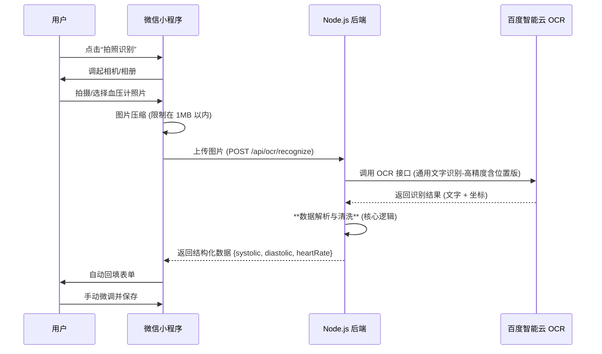

# 血压计拍照识别功能设计文档 (百度 OCR 版)

## 1. 功能概述

本功能旨在简化用户录入血压数据的过程。用户通过微信小程序拍摄血压计屏幕，系统自动识别并填充“收缩压”、“舒张压”和“心率”数据，用户确认无误后保存。

## 2. 技术选型

*   **前端**: 微信小程序 (Camera / Image API)
*   **后端**: Node.js (Express)
*   **OCR 服务**: **百度智能云 - 通用文字识别（高精度含位置版）**
    *   *理由*: 百度 OCR 中文及数字识别准确率高，且“含位置版”返回文字坐标，有利于根据血压计屏幕“从上到下”的布局逻辑进行结构化解析。

## 3. 系统架构



## 4. 接口设计

### 4.1 后端接口

*   **路径**: `/api/ocr/recognize`
*   **方法**: `POST`
*   **Content-Type**: `multipart/form-data`
*   **参数**:
    *   `image`: 图片文件 (Binary)
*   **响应**:
    ```json
    {
      "success": true,
      "data": {
        "systolic": 120,   // 收缩压
        "diastolic": 80,   // 舒张压
        "heartRate": 75,   // 心率
        "raw": "..."       // (可选) 原始识别文本，用于调试
      },
      "message": "识别成功"
    }
    ```

### 4.2 百度 OCR 接口配置

*   **API**: `https://aip.baidubce.com/rest/2.0/ocr/v1/accurate` (通用文字识别-高精度版)
*   **鉴权**: 需要 `API_KEY` 和 `SECRET_KEY` 获取 `Access Token`。

## 5. 数据解析策略 (核心)

血压计屏幕通常呈现为三行数字布局，从上到下依次为：高压、低压、心率。

### 5.1 解析步骤

1.  **预处理**: 过滤掉非数字字符（保留小数点，去除单位如 mmHg, /min 等）。
2.  **提取候选项**: 将 OCR 返回的每一行文字转换为数字对象，包含 `{ value, top }` (数值和 Y 轴坐标)。
3.  **数值范围过滤**:
    *   **收缩压 (Systolic)**: 60 - 260
    *   **舒张压 (Diastolic)**: 40 - 150
    *   **心率 (HeartRate)**: 30 - 200
4.  **排序与匹配**:
    *   按 `top` (Y 轴坐标) 从小到大排序（即从上到下）。
    *   **策略 A (理想情况)**: 如果过滤后恰好有 3 个数值：
        *   第 1 个 -> 收缩压
        *   第 2 个 -> 舒张压
        *   第 3 个 -> 心率
    *   **策略 B (缺失情况)**: 如果只有 2 个数值：
        *   较大的 -> 收缩压
        *   较小的 -> 舒张压
        *   心率置空
    *   **策略 C (冗余情况)**: 如果超过 3 个数值：
        *   优先取符合“收缩压 > 舒张压”逻辑且坐标相邻的两个数。
5.  **逻辑校验**:
    *   必须满足 `收缩压 > 舒张压`。
    *   如果解析结果不满足此条件，尝试交换数值或标记为识别失败。

## 6. 异常处理

*   **图片模糊/反光**: OCR 可能无法识别任何数字。
    *   *处理*: 后端返回 `success: false`，前端提示“无法识别数字，请保持光线充足并对准屏幕重试”。
*   **识别结果不完整**: 只识别出一个数字。
    *   *处理*: 尽可能填充（如只填高压），并提示用户“识别不完整，请手动补充”。
*   **网络超时**:
    *   *处理*: 设置 10s 超时限制，超时后提示用户手动输入。

## 7. 开发计划

1.  **申请百度 API**: 注册百度智能云账号，创建应用，获取 `API Key` 和 `Secret Key`。
2.  **后端环境配置**: 在 `.secret.dev` 中添加百度 Key。
3.  **后端实现**:
    *   集成 `baidu-aip-sdk` 或直接封装 HTTP 请求。
    *   编写 `OcrService` 类，包含 `recognize` 和 `parseBPData` 方法。
4.  **前端实现**:
    *   修改 `record` 页面，对接拍照和上传接口。

## 8. 示例代码 (解析逻辑)

```typescript
interface OCRLine {
  words: string;
  location: { top: number; left: number; width: number; height: number };
}

function parseBPData(lines: OCRLine[]) {
  // 1. 提取数字与坐标
  let candidates = lines
    .map(line => {
      const text = line.words.replace(/[^\d.]/g, ''); // 只留数字和小数点
      const value = parseFloat(text);
      return { value, top: line.location.top };
    })
    .filter(item => !isNaN(item.value));

  // 2. 按位置排序 (从上到下)
  candidates.sort((a, b) => a.top - b.top);

  // 3. 智能分配
  let result = { systolic: 0, diastolic: 0, heartRate: 0 };
  
  // 简单启发式：假设前三个有效数字对应 高/低/心率
  // 实际项目中需加入范围校验逻辑
  if (candidates.length >= 1) result.systolic = candidates[0].value;
  if (candidates.length >= 2) result.diastolic = candidates[1].value;
  if (candidates.length >= 3) result.heartRate = candidates[2].value;

  return result;
}
```


# 百度仪器表盘读数识别
```js
const axios = require('axios');
const AK = "ESyLlvBGiqa49gcjrBGgiW1r"
const SK = "m76sn0z4WdskkaViVsUTFYoLhUa5h9bR"

async function main() {
    var options = {
        'method': 'POST',
        'url': 'https://aip.baidubce.com/rest/2.0/ocr/v1/meter?access_token=' + await getAccessToken(),
        'headers': {
                'Content-Type': 'application/x-www-form-urlencoded',
                'Accept': 'application/json'
        },
        data: {
                'url': 'https://baidu-ai.bj.bcebos.com/ocr/meter.png',
                'probability': 'false',
                'poly_location': 'false'
        }
    };

    axios(options)
        .then(response => {
            console.log(response.data);
        })
        .catch(error => {
            throw new Error(error);
        })
}

/**
 * 使用 AK，SK 生成鉴权签名（Access Token）
 * @return string 鉴权签名信息（Access Token）
 */
function getAccessToken() {

    let options = {
        'method': 'POST',
        'url': 'https://aip.baidubce.com/oauth/2.0/token?grant_type=client_credentials&client_id=' + AK + '&client_secret=' + SK,
    }
    return new Promise((resolve, reject) => {
      axios(options)
          .then(res => {
              resolve(res.data.access_token)
          })
          .catch(error => {
              reject(error)
          })
    })
}
main();

//.////// 结果
{
    "words_result": [
        {
            "location": {
                "left": 391,
                "height": 6,
                "width": 12,
                "top": 115
            },
            "words": "am"
        },
        {
            "location": {
                "left": 346,
                "height": 21,
                "width": 43,
                "top": 116
            },
            "words": "10:38"
        },
        {
            "location": {
                "left": 410,
                "height": 20,
                "width": 36,
                "top": 116
            },
            "words": "12-11"
        },
        {
            "location": {
                "left": 368,
                "height": 78,
                "width": 88,
                "top": 152
            },
            "words": "5.8"
        },
        {
            "location": {
                "left": 401,
                "height": 14,
                "width": 53,
                "top": 240
            },
            "words": "mmol/L"
        }
    ],
    "words_result_num": 5,
    "log_id": "1991502093403624226"
}
```