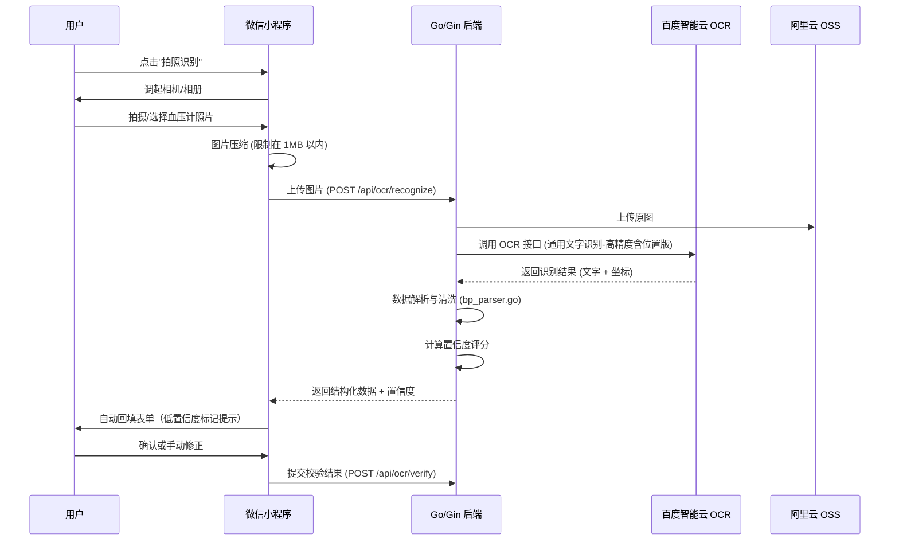

# 血压计拍照识别功能设计文档 (百度 OCR 版)

## 1. 功能概述

本功能旨在简化用户录入血压数据的过程。用户通过微信小程序拍摄血压计屏幕，系统自动识别并填充"收缩压"、"舒张压"和"心率"数据，用户确认无误后保存。

## 2. 技术选型

*   **前端**: 微信小程序 (Camera / Image API)
*   **后端**: Go (Gin)，实现位于 `server-go/`
*   **OCR 服务**: **百度智能云 - 通用文字识别（高精度含位置版）**
    *   *理由*: 百度 OCR 中文及数字识别准确率高，且"含位置版"返回文字坐标，有利于根据血压计屏幕"从上到下"的布局逻辑进行结构化解析。
*   **图片存储**: 阿里云 OSS

## 3. 系统架构



## 4. 接口设计

### 4.1 OCR 识别接口

*   **路径**: `/api/ocr/recognize`
*   **方法**: `POST`
*   **认证**: 需要 JWT
*   **Content-Type**: `multipart/form-data`
*   **参数**: `image` - 图片文件 (Binary)
*   **响应**:
    ```json
    {
      "success": true,
      "data": {
        "systolic": 120,
        "diastolic": 80,
        "heartRate": 75,
        "confidence": 0.9,
        "extractionStrategy": "keyword",
        "raw": "..."
      },
      "message": "识别成功"
    }
    ```

### 4.2 OCR 校验接口

*   **路径**: `/api/ocr/verify`
*   **方法**: `POST`
*   **认证**: 需要 JWT
*   **参数**:
    ```json
    {
      "ocr_log_id": 123,
      "action": "confirm",
      "corrected_values": {
        "systolic": 125,
        "diastolic": 82,
        "heartRate": 72
      }
    }
    ```

### 4.3 百度 OCR 接口配置

*   **API**: `https://aip.baidubce.com/rest/2.0/ocr/v1/accurate` (通用文字识别-高精度版)
*   **鉴权**: 需要 `BAIDU_OCR_API_KEY` 和 `BAIDU_OCR_SECRET_KEY` 获取 Access Token
*   **配置位置**: `.secret.dev` 环境变量

## 5. 数据解析策略 (核心)

血压计屏幕通常呈现为三行数字布局，从上到下依次为：高压、低压、心率。

实现位于 `server-go/utils/bp_parser.go`。

### 5.1 解析步骤

1.  **预处理**: 过滤掉非数字字符（保留小数点，去除单位如 mmHg, /min 等）
2.  **提取候选项**: 将 OCR 返回的每一行文字转换为数字对象，包含 `{ value, top }` (数值和 Y 轴坐标)
3.  **数值范围过滤**:
    *   **收缩压 (Systolic)**: 60 - 260
    *   **舒张压 (Diastolic)**: 40 - 150
    *   **心率 (HeartRate)**: 30 - 200
4.  **排序与匹配**:
    *   按 `top` (Y 轴坐标) 从小到大排序（即从上到下）
    *   **策略 A - keyword**: 通过关键词("SYS"/"DIA"/"PUL"等)直接匹配 → 置信度 0.9
    *   **策略 B - keyword+positional**: 关键词部分匹配 + 位置推断补全 → 置信度 0.7
    *   **策略 C - positional**: 纯位置推断（3个数从上到下为高/低/心率）→ 置信度 0.5
5.  **逻辑校验**:
    *   必须满足 `收缩压 > 舒张压`
    *   如果解析结果不满足此条件，尝试交换数值或标记为识别失败

### 5.2 置信度评分

*   基础置信度由解析策略决定（keyword > keyword+positional > positional）
*   若成功提取字段少于 2 个，置信度减半
*   置信度 < 0.7 时标记为 `needs_review`，需要用户确认

## 6. 异常处理

*   **图片模糊/反光**: OCR 可能无法识别任何数字
    *   *处理*: 后端返回 `success: false`，前端提示"无法识别数字，请保持光线充足并对准屏幕重试"
*   **识别结果不完整**: 只识别出一个数字
    *   *处理*: 尽可能填充（如只填高压），并提示用户"识别不完整，请手动补充"
*   **低置信度结果**: 解析策略不确定
    *   *处理*: 标记 `needs_review`，要求用户确认或修正后再保存
*   **网络超时**:
    *   *处理*: 设置 10s 超时限制，超时后提示用户手动输入

## 7. 关键文件

| 文件 | 用途 |
|------|------|
| `server-go/handlers/ocr.go` | OCR 识别 handler |
| `server-go/handlers/ocr_verify.go` | OCR 校验 handler |
| `server-go/utils/bp_parser.go` | OCR 结果解析 + 置信度 |
| `server-go/utils/baidu_ocr.go` | 百度 OCR API 封装 |
| `server-go/utils/oss.go` | 阿里云 OSS 图片上传 |
| `miniprogram/pages/record/record.ts` | 前端拍照+回填 |
